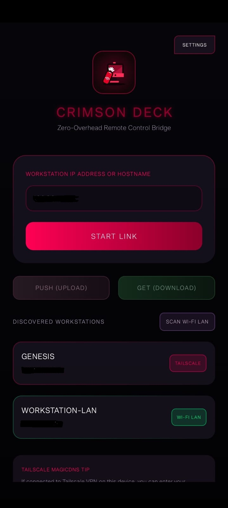
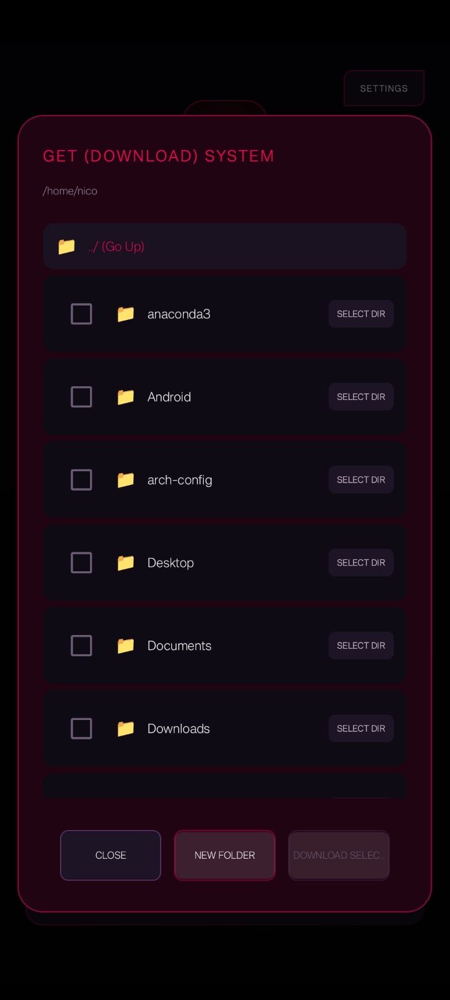
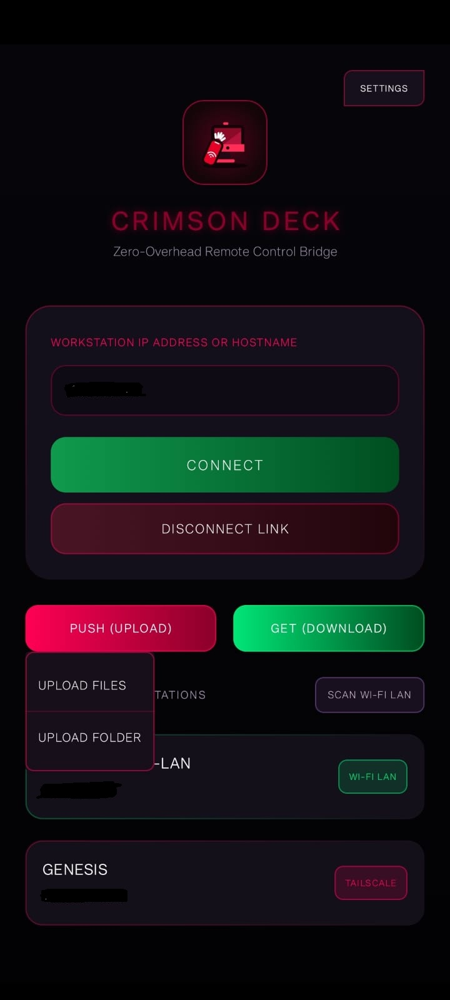

# Crimson Deck

Crimson Deck is a high-performance, ultra-low-latency companion remote control bridge and video streaming system designed specifically for Linux workstation control directly from an Android mobile device. Built with a premium cyberpunk aesthetic and custom tactical UI features, it provides seamless absolute touch controls, window manager workspace switching, text injection macros, and clipboard integration over local Wi-Fi or secure Tailscale overlay networks.

---

## Visual Application Showcase

| 1. Connection & Autodiscovery | 2. Live Control Canvas |
|:---:|:---:|
|  |  |

| 3. Settings Dashboard | 4. 2D Interactive Theme Engine |
|:---:|:---:|
|  |  |

| 5. Macro Lists & Synced Configs | 6. Sequence Keypad Builder |
|:---:|:---:|
|  |  |

| 7. Local File Downloads | 8. Workspace Uploads Panel |
|:---:|:---:|
|  |  |

---

## Key Features

* **Ultra-Low-Latency H.264 Streaming**: Leverages a fast Rust-based X11 MIT-SHM screen capture engine paired with standard system software encoders (`openh264`) or Nvidia hardware video acceleration (`h264_nvenc`) to capture workstation screens.
* **Direct Hardware GPU Surface Rendering**: Decodes Annex B video packages directly on the Android GPU using physical `MediaCodec` and `TextureView` configurations, rendering at a smooth, continuous **60 FPS** with drift-compensated pacing.
* **Privilege-Dropped Input Emulation**: Features a standard user-space Go input emulator utilizing X11 utilities (`xdotool` and `xclip`). Both Rust and Go processes automatically drop `root` privileges to match standard workstation display credentials.
* **Sequential FIFO Command Pipeline**: Implements a thread-safe Go worker queue to process incoming absolute touch, mouse relative movement, clicks, and keys in their exact sequential order, completely resolving key repeat issues.
* **Cyberpunk Custom Theme Engine**: Outfitted with a reactive design token controller, supporting 5 curated high-contrast system themes (including Crimson Protocol and Toxic Cyber) alongside a custom **2D 4-Point Hue-Value Canvas Color Picker** to customize accents.
* **Custom Remote Keyboard Macros**: Features a non-blocking coroutine-based sequence executor supporting custom uppercase shifts, symbols, punctuation inputs, and millisecond pacing controls. It supports saving, editing, and backup exports in **JSON, TOML, and YAML** formats.
* **Automatic Subnet & Tailscale Discovery**: Automatically sweeps local `/24` subnets and queries Tailscale MagicDNS namespaces (`genesis`, `genesis.tailscale.net`) to locate and link workstations in seconds.
* **Zero-Voicing Viewport edge-locks & Drag Selection**: Features zero-pivot scale controls to lock edges to margins when zoomed in, physical GPU viewport boundary clipping, a tactical glowing cursor target, and native multi-finger touch-to-scroll gesture emulations.

---

## Repository Structure

```
├── android/                       # Jetpack Compose Android Companion App
│   ├── app/                       # Android app module (declarations, vector app launcher)
│   ├── build.gradle.kts           # Gradle configuration with automated config.json assets copier
│   └── config.json.example        # Clean, secure JSON configuration template for Android client
│
├── server/                        # Workstation Systems Server Tier
│   ├── go/                        # Network gateway server, xdotool executor & macro manager
│   ├── rust/                      # Privilege-dropped capture engine and UDS IPC controller
│   └── config.json.example        # Clean, secure JSON configuration template for Host server
│
├── docs/                          # Comprehensive technical design documentation
│   ├── Getting-Started.md         # Full installation, compilation, and system requirements
│   ├── System-Architecture.md     # In-depth architectural designs and communication flows
│   └── Video-Streaming-Engine.md  # Detailed capture loops and hardware decoding layouts
│
├── build_android.sh               # Local script to compile release/debug APKs
├── build_and_install_android.sh   # Direct script to compile and install APK over ADB
├── build_server.sh                # Automated server compilation script
└── .gitignore                     # Secure exclusions to protect private properties/logs
```

---

## Quick Start Guide

### 1. Host Server Compilation & Execution (Arch Linux)

#### Dependencies
Ensure standard emulation tools are installed on your host system:
```bash
sudo pacman -S xdotool xclip ffmpeg openh264
```

#### Compile and Start
Run the automated build script to generate the unified server binary:
```bash
# 1. Compile the systems server
./build_server.sh

# 2. Launch the server (Rust will dynamically drop root permissions to spawn the Go gateway)
sudo ./crimson-deck-server
```

---

### 2. Android Client Compilation & Deployment

#### Dependencies
Connect your physical Android device over USB with **USB Debugging** enabled in Developer Options.

#### Build and Install
Run the USB deployment script to compile the optimized package and install it directly on your device:
```bash
# Compiles the release APK and installs it straight to the USB-connected phone
./build_and_install_android.sh release
```
* **JDK 17 Overrides**: The build script automatically detects `$HOME/jdk17` and standard OpenJDK directories to bypass compile errors caused by newer default Java 26 system compilers.
* **Dynamic local.properties**: Gradle automatically generates the Android SDK path mappings (`local.properties`) using dynamic environment variable evaluations at compilation time.
* **Standalone APKs**: Standalone packages are saved to the project root directory using the current version name, such as `crimson-deck-2.1-release.apk` (and `crimson-deck-2.1-debug.apk`).

---

## Secure Configuration & Git Sharing Policies

To ensure maximum security and privacy when sharing or publishing this repository:
* **All active configurations are Git-ignored**: The active runtime configs (`android/config.json` and `server/config.json`) along with developer properties (`local.properties`) and generated Unix sockets (`*.sock`) are completely blocked in [.gitignore](file:///.gitignore).
* **Generic Templates**: Developers can easily customize their workstations by copying the provided `.example` files:
  ```bash
  # On the Workstation Server
  cp server/config.json.example server/config.json
  
  # On the Android App
  cp android/config.json.example android/config.json
  ```
  Simply replace `"workstation-hostname"` in the copied configs with your private host (e.g. `"genesis"`) or local IP configurations. They will run seamlessly without ever leaking to the outside world!

---

## Acknowledgements

Crimson Deck's high-performance capture loop, low-latency H.264 video decoding architecture, and remote-control bridge paradigm are heavily inspired by the pioneering open-source work of **[RustDesk](https://github.com/rustdesk/rustdesk)**. 

Specifically, RustDesk's elegant abstractions for Rust-based system displays, raw pixel buffer memory management, and robust low-overhead hardware decoding channels laid the conceptual foundation for our lightweight Android GPU-accelerated video streaming engine. We are deeply grateful to the RustDesk team and contributors for their outstanding contributions to the open-source remote-desktop ecosystem.

---

## License
Developed with care for premium, tactical workstation controls.
